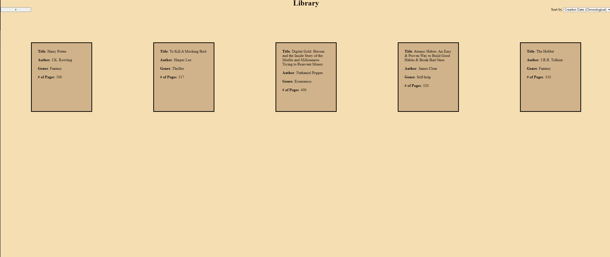

# Library
## Description
A virtual book shelf that keeps track of books that users may have read or plan to read.
Users can add and remove books to the bookshelf. Information pertaining to each book is logged and a database is to be implemented in the near future to maintain
a user's book collection upon exiting the browser and re-entering. Users can modify information of books already present in their library. Sorting of the books by different criteria such as title name, author, genre, and number 
of pages is possible.

## Demo
Access the app [here](https://alansimon816.github.io/Library/).

